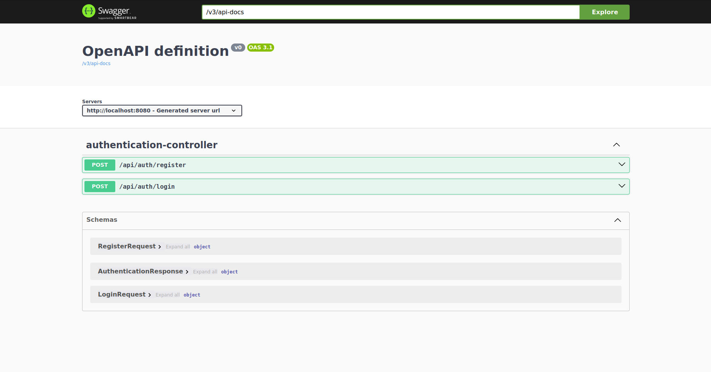

# User Management API

[](https://spring.io/projects/spring-boot)
[](https://openjdk.org/projects/jdk/24/)
[](https://www.postgresql.org/)
[](https://maven.apache.org/)
[](http://localhost:8080/swagger-ui.html)
[](LICENSE)

## Table of Contents

- [User Management API](#user-management-api)
    - [Table of Contents](#table-of-contents)
    - [Overview](#overview)
    - [Features](#features)
    - [Technology Stack](#technology-stack)
    - [Prerequisites](#prerequisites)
    - [Getting Started](#getting-started)
        - [1. Clone the Repository](#1-clone-the-repository)
        - [2. Database Setup](#2-database-setup)
        - [3. Configure Application Properties](#3-configure-application-properties)
        - [4. Build the Project](#4-build-the-project)
        - [5. Run the Application](#5-run-the-application)
    - [API Endpoints](#api-endpoints)
        - [Authentication](#authentication)
        - [Users (Protected)](#users-protected)
    - [API Documentation (Swagger UI)](#api-documentation-swagger-ui)
    - [Postman Collection (Optional)](#postman-collection-optional)
    - [Development](#development)
        - [Project Structure](#project-structure)
        - [Adding New Features](#adding-new-features)
    - [Troubleshooting](#troubleshooting)
    - [Contributing](#contributing)
    - [License](#license)
    - [Contact](#contact)

---

## Overview

This project is a robust and secure User Management API built with Spring Boot. It provides core functionalities for user authentication (registration, login) and basic user management, leveraging modern best practices in backend development, including JWT for token-based security and a PostgreSQL database for data persistence.

## Features

-   **User Registration:** Create new user accounts with unique email addresses.
-   **User Authentication:** Secure user login using email and password, generating JSON Web Tokens (JWT) for subsequent authorized requests.
-   **JWT-Based Security:** Secure API endpoints using JWT, ensuring only authenticated and authorized users can access protected resources.
-   **Password Hashing:** Store user passwords securely using BCrypt hashing.
-   **Database Integration:** Persistent storage of user data using PostgreSQL and Spring Data JPA.
-   **RESTful API Design:** Clean and intuitive API endpoints following REST principles.
-   **API Documentation:** Interactive API documentation using Swagger UI for easy testing and understanding of endpoints.
-   **Developer Tools:** Spring Boot DevTools for faster development cycles (auto-restart, live reload).

## Technology Stack

-   **Backend:** Java 24, Spring Boot 3.5.3
    -   Spring Data JPA
    -   Spring Security (with JWT)
    -   Spring Web (RESTful API)
    -   Lombok (for boilerplate code reduction)
-   **Database:** PostgreSQL
-   **Build Tool:** Apache Maven
-   **API Documentation:** Springdoc OpenAPI (Swagger UI)
-   **JWT Library:** JJWT

## Prerequisites

Before you begin, ensure you have the following installed on your system:

-   **Java Development Kit (JDK) 24:**
    -   Download from [OpenJDK](https://openjdk.org/projects/jdk/24/) or your preferred distribution (e.g., Adoptium, Oracle JDK).
    -   Verify installation: `java --version`
-   **Apache Maven 3.x:**
    -   Download from [Maven Website](https://maven.apache.org/download.cgi).
    -   Verify installation: `mvn --version`
-   **PostgreSQL:**
    -   Download and install from [PostgreSQL Website](https://www.postgresql.org/download/).
    -   Ensure it's running.
-   **Git:**
    -   Download from [Git SCM](https://git-scm.com/downloads).

## Getting Started

Follow these steps to get your User Management API up and running on your local machine.

### 1. Clone the Repository

```bash
git clone [https://github.com/your-username/user-management-api.git](https://github.com/your-username/user-management-api.git)
cd user-management-api
```

2. Database Setup

    Create a PostgreSQL Database:
    Open your PostgreSQL client (e.g., psql, pgAdmin, or DBeaver) and create a new database.
    SQL

    CREATE DATABASE user_management_db;

    (You can choose a different name, just make sure to update application.properties accordingly).

3. Configure Application Properties

Create or open the src/main/resources/application.properties file and add/update the following configurations:
Properties

# Server Port
server.port=8080

# Spring Data JPA Configuration
spring.jpa.hibernate.ddl-auto=update # Use 'update' for development, 'none' or 'validate' for production
spring.jpa.show-sql=true
spring.jpa.properties.hibernate.format_sql=true

# Database Connection (PostgreSQL)
spring.datasource.url=jdbc:postgresql://localhost:5432/user_management_db
spring.datasource.username=your_db_username
spring.datasource.password=your_db_password
spring.datasource.driver-class-name=org.postgresql.Driver

# JWT Configuration
application.security.jwt.secret-key=aStrongSecretKeyThatIsAtLeast32BytesLongAndShouldBeBase64EncodedInProduction
application.security.jwt.expiration=86400000
# 24 hours in milliseconds (24 * 60 * 60 * 1000)
# application.security.jwt.refresh-token.expiration=604800000
# 7 days in milliseconds (7 * 24 * 60 * 60 * 1000)

# Springdoc OpenAPI (Swagger UI)
springdoc.swagger-ui.path=/swagger-ui.html
springdoc.api-docs.path=/v3/api-docs

Important:

    Replace your_db_username and your_db_password with your actual PostgreSQL credentials.

    For application.security.jwt.secret-key, use a strong, randomly generated key for production environments. It should be at least 256 bits (32 bytes) long.

4. Build the Project

Navigate to the project's root directory in your terminal and build the project using Maven:
Bash

mvn clean install

This command compiles the code, runs tests, and packages the application into a JAR file in the target/ directory.

5. Run the Application

You can run the application using the Spring Boot Maven plugin:
Bash

mvn spring-boot:run

The application will start on http://localhost:8080 (or the port you configured). You should see logs indicating that Tomcat has started.

API Endpoints

The API base URL is http://localhost:8080/api.

Authentication

Method	Endpoint	Description	Request Body Example (JSON)
POST	/auth/register	Registers a new user account.	{ "name": "John Doe", "email": "john.doe@example.com", "password": "password123" }
POST	/auth/authenticate	Authenticates a user and returns a JWT.	{ "email": "john.doe@example.com", "password": "password123" }

Users (Protected)

These endpoints require a valid JWT in the Authorization header (e.g., Bearer <YOUR_JWT_TOKEN>).
Method	Endpoint	Description
GET	/users	Retrieves a list of all users.
GET	/users/{id}	Retrieves a specific user by ID.
PUT	/users/{id}	Updates an existing user by ID.
DELETE	/users/{id}	Deletes a user by ID.

(Note: The exact protected endpoints will depend on your controller implementations. Please adjust this section based on your actual code.)

API Documentation (Swagger UI)

Once the application is running, you can access the interactive API documentation (Swagger UI) at:

http://localhost:8080/swagger-ui.html

This interface allows you to:

    View all available endpoints.

    Understand request and response schemas.

    Execute API requests directly from the browser.

For a visual reference, here's what the Swagger UI looks like:

